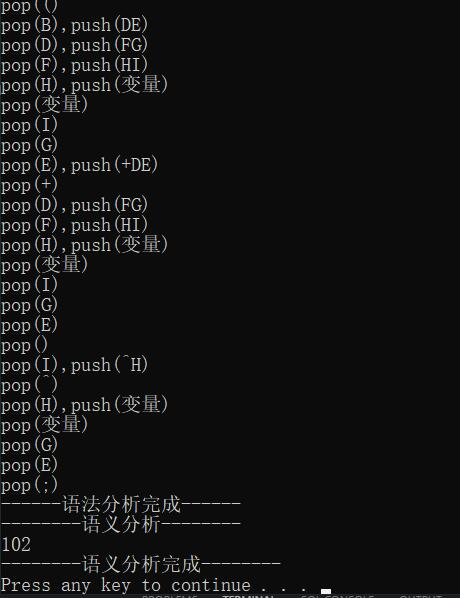

# little-compiler

## 说明

A little compiler for elementary function

+ 主要内容是实现一个初等函数运算语言的编译器前端基本实现
+ 未作后端优化
+ 本程序从输入界面或文件中接收一个包含了各种初等函数表达式的字符串，程序对这些表达式进行计算和求值，并输出相应的值
+ 命令行给出基本的解析和编译过程
+ 

比如输入：
```
x = 0.5*PI;
y = E;
z = 3;
?1/3*(ln(y)+5*sin(x))+(7+z)^2;
$
```
输出：

```
102
```


## 初等函数表

函数类型 | 函数名称 | 参数说明 |
:-:     | :-:     |  :-:    |
sin(x) | 正弦函数 | x | 
cos(x) | 余弦函数 | x |
tg(x)  | 正切函数 | x |
ctg(x) | 余切函数 | x |
x^y    | 幂函数/指数函数 |x：底数,y：指数 |
log(x,y) | 对数 | x：底数,y：指数
lg(x) | 以10为底的对数 | x |
ln(x) | 以e为底的对数 | x |
log(x) | 以2为底的对数 | x |

## 记号表

sin	|cos|tg	|ctg|log|lg	|ln	|PI	|E	|$
:-: | :-:|:-:|:-: | :-:|:-:|:-: | :-:|:-:|:-: |
0	|1	|2	|3	|4	|5	|6	|7	|8	|9
?	|;	|+	|-	|*	|/	|=	|^	|(	|)
10	|11	|12	|13	|14	|15	|16	|17	|18	|19
变量|常量								
20	|21								

## 结果

示例截图：


